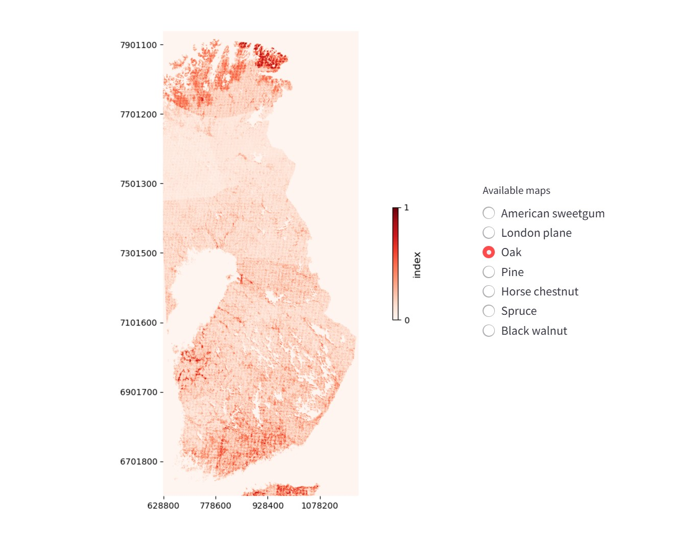

# Carbon sink planning tool

The project was built as a team for a hackathon - Junction 2024. The task was to utilize satellite data to address sustainability issues.

Our goal was to aid governance and other bodies in carbon sink planning.
We utilized soil data, land cover data and weather data to determine the optimal locations to plant carbon sinks.

More details in the pitch deck:
https://docs.google.com/presentation/d/1hxc4hNrIjpkBPzDgIy5G75mM75H-B_y82ZKY6XuH5vc/

The tool is available at:
https://carbonsinkmap.streamlit.app/

_Forest image: CC BY 2.0 Roman Boed_

## What did I learn?
- Working with raster map data in Python
  - Libraries (Rasterio, Numpy, Pyproj)
  - Projections and transformation maps
- I learnt about the variety of satellite data
  - Soil type
  - Land cover
  - Surface temperature
  - NDVI
  - Biomass
- Working on a data science project as a team
  - Task division
  - Sharing data and code
 
## Potential next steps
- Building a more accurate model for tree compatibility
- Incorporating the whole world
- Fetching the data using an API
- Utilizing more purpose-built libraries, such as Xarray, Earth Engine API and Sentinelhub API
- Building a more robust and automated data processing pipeline
- Proper and efficient handling of raster maps
  - Projection transformations
  - Cropping
  - Aggregates
